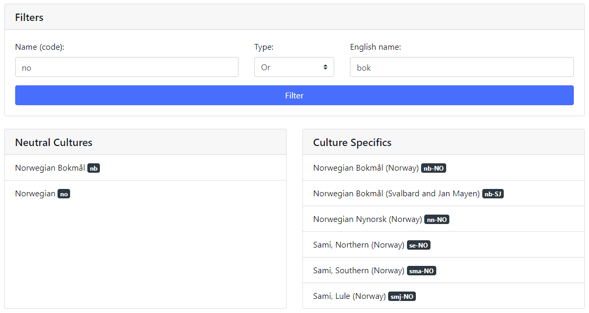

# CultureInfo-Browser
This is a simple Asp.Net Core `CultureInfo` explorer that I built to help in the [ForEvolve/ForEvolve.AspNetCore.Localization](https://github.com/ForEvolve/ForEvolve.AspNetCore.Localization) project.

A live version is hosted on a free Azure Web App: https://cultureinfobrowser.azurewebsites.net

